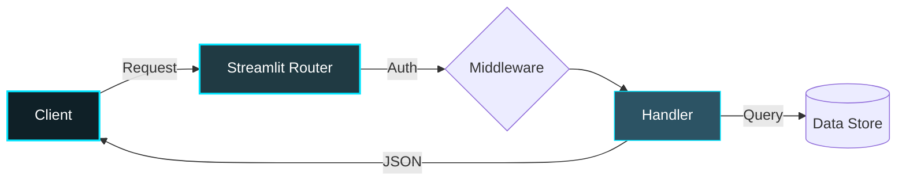

<div align="center">

![Header](data:image/svg+xml;base64,PHN2ZyB3aWR0aD0iODAwIiBoZWlnaHQ9IjIwMCIgdmlld0JveD0iMCAwIDgwMCAyMDAiIHhtbG5zPSJodHRwOi8vd3d3LnczLm9yZy8yMDAwL3N2ZyI+CiAgPGRlZnM+CiAgICA8bGluZWFyR3JhZGllbnQgaWQ9ImJnIiB4MT0iMCUiIHkxPSIwJSIgeDI9IjEwMCUiIHkyPSIxMDAlIj4KICAgICAgPHN0b3Agb2Zmc2V0PSIwJSIgc3RvcC1jb2xvcj0iIzBmMjAyNyIvPgogICAgICA8c3RvcCBvZmZzZXQ9IjUwJSIgc3RvcC1jb2xvcj0iIzIwM2E0MyIvPgogICAgICA8c3RvcCBvZmZzZXQ9IjEwMCUiIHN0b3AtY29sb3I9IiMyYzUzNjQiLz4KICAgIDwvbGluZWFyR3JhZGllbnQ+CiAgICA8ZmlsdGVyIGlkPSJnbG93Ij4KICAgICAgPGZlR2F1c3NpYW5CbHVyIHN0ZERldmlhdGlvbj0iNCIgcmVzdWx0PSJiIi8+CiAgICAgIDxmZUNvbXBvc2l0ZSBpbj0iU291cmNlR3JhcGhpYyIgaW4yPSJiIiBvcGVyYXRvcj0ib3ZlciIvPgogICAgPC9maWx0ZXI+CiAgICA8ZmlsdGVyIGlkPSJnbG93MiI+CiAgICAgIDxmZUdhdXNzaWFuQmx1ciBzdGREZXZpYXRpb249IjgiIHJlc3VsdD0iYiIvPgogICAgICA8ZmVDb21wb3NpdGUgaW49IlNvdXJjZUdyYXBoaWMiIGluMj0iYiIgb3BlcmF0b3I9Im92ZXIiLz4KICAgIDwvZmlsdGVyPgogIDwvZGVmcz4KICA8cmVjdCB3aWR0aD0iMTAwJSIgaGVpZ2h0PSIxMDAlIiBmaWxsPSJ1cmwoI2JnKSIgcng9IjEyIi8+CiAgCiAgPCEtLSBHcmlkIGxpbmVzIC0tPgogIDxsaW5lIHgxPSIwIiB5MT0iNTAiIHgyPSI4MDAiIHkyPSI1MCIgc3Ryb2tlPSIjMDBlNWZmIiBvcGFjaXR5PSIwLjA1IiBzdHJva2Utd2lkdGg9IjEiLz4KICA8bGluZSB4MT0iMCIgeTE9IjEwMCIgeDI9IjgwMCIgeTI9IjEwMCIgc3Ryb2tlPSIjMDBlNWZmIiBvcGFjaXR5PSIwLjA1IiBzdHJva2Utd2lkdGg9IjEiLz4KICA8bGluZSB4MT0iMCIgeTE9IjE1MCIgeDI9IjgwMCIgeTI9IjE1MCIgc3Ryb2tlPSIjMDBlNWZmIiBvcGFjaXR5PSIwLjA1IiBzdHJva2Utd2lkdGg9IjEiLz4KICA8bGluZSB4MT0iMjAwIiB5MT0iMCIgeDI9IjIwMCIgeTI9IjIwMCIgc3Ryb2tlPSIjMDBlNWZmIiBvcGFjaXR5PSIwLjA1IiBzdHJva2Utd2lkdGg9IjEiLz4KICA8bGluZSB4MT0iNDAwIiB5MT0iMCIgeDI9IjQwMCIgeTI9IjIwMCIgc3Ryb2tlPSIjMDBlNWZmIiBvcGFjaXR5PSIwLjA1IiBzdHJva2Utd2lkdGg9IjEiLz4KICA8bGluZSB4MT0iNjAwIiB5MT0iMCIgeDI9IjYwMCIgeTI9IjIwMCIgc3Ryb2tlPSIjMDBlNWZmIiBvcGFjaXR5PSIwLjA1IiBzdHJva2Utd2lkdGg9IjEiLz4KICAKICAKICA8Y2lyY2xlIGN4PSI1NDAiIGN5PSIzMCIgcj0iMiIgZmlsbD0iIzAwZTVmZiIgb3BhY2l0eT0iMC42Ij4KICAgIDxhbmltYXRlIGF0dHJpYnV0ZU5hbWU9ImN4IiB2YWx1ZXM9IjU0MDsgMjYwOyA1NDAiIGR1cj0iN3MiIHJlcGVhdENvdW50PSJpbmRlZmluaXRlIiAvPgogICAgPGFuaW1hdGUgYXR0cmlidXRlTmFtZT0ib3BhY2l0eSIgdmFsdWVzPSIwLjM7IDAuOTsgMC4zIiBkdXI9IjhzIiByZXBlYXRDb3VudD0iaW5kZWZpbml0ZSIgLz4KICA8L2NpcmNsZT4KICA8Y2lyY2xlIGN4PSI3MDAiIGN5PSI1NSIgcj0iMyIgZmlsbD0iIzAwZTVmZiIgb3BhY2l0eT0iMC42Ij4KICAgIDxhbmltYXRlIGF0dHJpYnV0ZU5hbWU9ImN4IiB2YWx1ZXM9IjcwMDsgMTAwOyA3MDAiIGR1cj0iNnMiIHJlcGVhdENvdW50PSJpbmRlZmluaXRlIiAvPgogICAgPGFuaW1hdGUgYXR0cmlidXRlTmFtZT0ib3BhY2l0eSIgdmFsdWVzPSIwLjM7IDAuOTsgMC4zIiBkdXI9IjdzIiByZXBlYXRDb3VudD0iaW5kZWZpbml0ZSIgLz4KICA8L2NpcmNsZT4KICA8Y2lyY2xlIGN4PSI1MDAiIGN5PSI4MCIgcj0iNCIgZmlsbD0iIzAwZTVmZiIgb3BhY2l0eT0iMC42Ij4KICAgIDxhbmltYXRlIGF0dHJpYnV0ZU5hbWU9ImN4IiB2YWx1ZXM9IjUwMDsgMzAwOyA1MDAiIGR1cj0iN3MiIHJlcGVhdENvdW50PSJpbmRlZmluaXRlIiAvPgogICAgPGFuaW1hdGUgYXR0cmlidXRlTmFtZT0ib3BhY2l0eSIgdmFsdWVzPSIwLjM7IDAuOTsgMC4zIiBkdXI9IjhzIiByZXBlYXRDb3VudD0iaW5kZWZpbml0ZSIgLz4KICA8L2NpcmNsZT4KICA8Y2lyY2xlIGN4PSI2NjAiIGN5PSIxMDUiIHI9IjIiIGZpbGw9IiMwMGU1ZmYiIG9wYWNpdHk9IjAuNiI+CiAgICA8YW5pbWF0ZSBhdHRyaWJ1dGVOYW1lPSJjeCIgdmFsdWVzPSI2NjA7IDE0MDsgNjYwIiBkdXI9IjdzIiByZXBlYXRDb3VudD0iaW5kZWZpbml0ZSIgLz4KICAgIDxhbmltYXRlIGF0dHJpYnV0ZU5hbWU9Im9wYWNpdHkiIHZhbHVlcz0iMC4zOyAwLjk7IDAuMyIgZHVyPSI4cyIgcmVwZWF0Q291bnQ9ImluZGVmaW5pdGUiIC8+CiAgPC9jaXJjbGU+CiAgPGNpcmNsZSBjeD0iNTAwIiBjeT0iMTMwIiByPSIzIiBmaWxsPSIjMDBlNWZmIiBvcGFjaXR5PSIwLjYiPgogICAgPGFuaW1hdGUgYXR0cmlidXRlTmFtZT0iY3giIHZhbHVlcz0iNTAwOyAzMDA7IDUwMCIgZHVyPSI2cyIgcmVwZWF0Q291bnQ9ImluZGVmaW5pdGUiIC8+CiAgICA8YW5pbWF0ZSBhdHRyaWJ1dGVOYW1lPSJvcGFjaXR5IiB2YWx1ZXM9IjAuMzsgMC45OyAwLjMiIGR1cj0iN3MiIHJlcGVhdENvdW50PSJpbmRlZmluaXRlIiAvPgogIDwvY2lyY2xlPgogIDxjaXJjbGUgY3g9IjM4MCIgY3k9IjE1NSIgcj0iNCIgZmlsbD0iIzAwZTVmZiIgb3BhY2l0eT0iMC42Ij4KICAgIDxhbmltYXRlIGF0dHJpYnV0ZU5hbWU9ImN4IiB2YWx1ZXM9IjM4MDsgNDIwOyAzODAiIGR1cj0iNnMiIHJlcGVhdENvdW50PSJpbmRlZmluaXRlIiAvPgogICAgPGFuaW1hdGUgYXR0cmlidXRlTmFtZT0ib3BhY2l0eSIgdmFsdWVzPSIwLjM7IDAuOTsgMC4zIiBkdXI9IjdzIiByZXBlYXRDb3VudD0iaW5kZWZpbml0ZSIgLz4KICA8L2NpcmNsZT4KICAKICA8IS0tIFNjYW5uaW5nIGxpbmUgLS0+CiAgPHJlY3QgeD0iMCIgeT0iMCIgd2lkdGg9IjgwMCIgaGVpZ2h0PSIzIiBmaWxsPSIjMDBlNWZmIiBvcGFjaXR5PSIwLjMiPgogICAgPGFuaW1hdGUgYXR0cmlidXRlTmFtZT0ieSIgdmFsdWVzPSIwOyAyMDA7IDAiIGR1cj0iNnMiIHJlcGVhdENvdW50PSJpbmRlZmluaXRlIi8+CiAgPC9yZWN0PgogIAogIDx0ZXh0IHg9IjUwJSIgeT0iNDIlIiBmb250LWZhbWlseT0iQXJpYWwsc2Fucy1zZXJpZiIgZm9udC13ZWlnaHQ9ImJvbGQiIGZvbnQtc2l6ZT0iMzgiIGZpbGw9IiMwMGU1ZmYiIHRleHQtYW5jaG9yPSJtaWRkbGUiIGZpbHRlcj0idXJsKCNnbG93KSIgc3R5bGU9ImxldHRlci1zcGFjaW5nOjRweCI+CiAgICBVSURBSSBIQUNLQVRIT04gU09MVVRJT04KICA8L3RleHQ+CiAgPHRleHQgeD0iNTAlIiB5PSI2MiUiIGZvbnQtZmFtaWx5PSJBcmlhbCxzYW5zLXNlcmlmIiBmb250LXNpemU9IjEzIiBmaWxsPSIjODBkZWVhIiB0ZXh0LWFuY2hvcj0ibWlkZGxlIiBzdHlsZT0ibGV0dGVyLXNwYWNpbmc6M3B4O29wYWNpdHk6MC44Ij4KICAgIFBST1BSSUVUQVJZIFBZVEhPTiBBUkNISVRFQ1RVUkUKICA8L3RleHQ+CiAgCiAgPCEtLSBCb3R0b20gYWNjZW50IGxpbmUgLS0+CiAgPGxpbmUgeDE9IjI1MCIgeTE9IjE3NSIgeDI9IjU1MCIgeTI9IjE3NSIgc3Ryb2tlPSIjMDBlNWZmIiBzdHJva2Utd2lkdGg9IjIiIGZpbHRlcj0idXJsKCNnbG93KSI+CiAgICA8YW5pbWF0ZSBhdHRyaWJ1dGVOYW1lPSJ4MSIgdmFsdWVzPSIyNTA7MzAwOzI1MCIgZHVyPSIzcyIgcmVwZWF0Q291bnQ9ImluZGVmaW5pdGUiLz4KICAgIDxhbmltYXRlIGF0dHJpYnV0ZU5hbWU9IngyIiB2YWx1ZXM9IjU1MDs1MDA7NTUwIiBkdXI9IjNzIiByZXBlYXRDb3VudD0iaW5kZWZpbml0ZSIvPgogIDwvbGluZT4KPC9zdmc+)

<br/>

<p align="center">
  
  
  
  
</p>

  

<br/>


</div>

---

## Overview

> Analytics dashboard for processing national-scale demographic data.

**UIDAI Hackathon Solution** is an advanced api / backend service system engineered by **Karthik Idikuda**. Built with Streamlit.

<br/>

## System Architecture



<br/>

## Project Structure

```
UIDAI-Hackathon-Solution/
  .DS_Store
  LICENSE
  README.md
  app.py
  icons.py
  profile.jpeg
  requirements.txt
  styles.py
  __pycache__/
    icons.cpython-311.pyc
    styles.cpython-311.pyc
    utils.cpython-311.pyc
  api_data_aadhar_biometric/
    api_data_aadhar_biometric_0_500000.csv
    api_data_aadhar_biometric_1000000_1500000.csv
    api_data_aadhar_biometric_1500000_1861108.csv
    api_data_aadhar_biometric_500000_1000000.csv
  api_data_aadhar_demographic/
    api_data_aadhar_demographic_0_500000.csv
    api_data_aadhar_demographic_1000000_1500000.csv
    api_data_aadhar_demographic_1500000_2000000.csv
    api_data_aadhar_demographic_2000000_2071700.csv
  api_data_aadhar_enrolment/
    api_data_aadhar_enrolment_0_500000.csv
    api_data_aadhar_enrolment_1000000_1006029.csv
    api_data_aadhar_enrolment_500000_1000000.csv
  page_modules/
    anomaly_detection.py
    biometrics.py
    dashboard.py
    demographics.py
```

<br/>

## Technical Specifications

| Attribute | Detail |
|:---|:---|
| **Primary Language** | `Python` |
| **Project Category** | `API / Backend Service` |
| **Total Source Files** | `37` |
| **Frameworks** | `Streamlit` |
| **IP Status** | `Strictly Proprietary` |

## Dependencies

<p align="left">
  <code>numpy</code>  <code>scikit-learn</code>  <code>pandas</code>  <code>plotly</code>  <code>streamlit</code>  <code>python-dateutil</code>  <code>openpyxl</code>
</p>


## STRICT LEGAL WARNING

> **PROPRIETARY AND CONFIDENTIAL**

This software is the **exclusive property of Karthik Idikuda**.

- **NO PERMISSION** to use, copy, modify, or distribute without written consent.
- **UNAUTHORIZED USE** results in litigation, financial penalties, and criminal prosecution.
- **LICENSING:** Contact Karthik Idikuda directly to negotiate terms.

*By viewing this repository, you accept these proprietary terms.*

---

<div align="center">
  <br/>
  
</div>

<!-- WATERMARK: S0ktUFJPUFJJRVRBUlktVUlEQUktSGFja2F0aG9uLVNvbHV0aW9uLTIwMjY= -->
